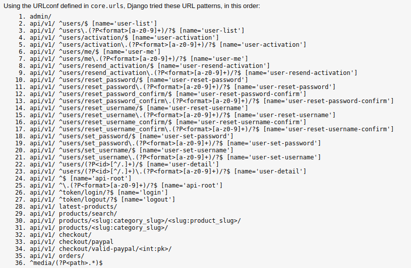

# ecom_vue

## the api of this project can be found on the github repository:
  https://github.com/Yaacov-Zerrad/e-talit
 
## you can also find the api online with the link:
  https://api-ecom-pre.herokuapp.com/
  
## Project setup
```
npm install
```

### Compiles and hot-reloads for development
```
npm run serve
```

### Compiles and minifies for production
```
npm run build
```

### Customize configuration
See [Configuration Reference](https://cli.vuejs.org/config/).
