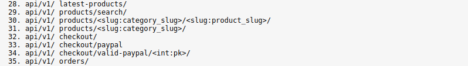
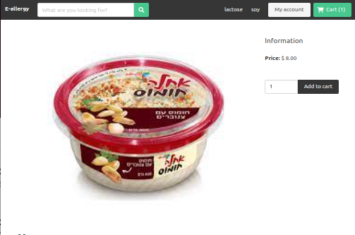
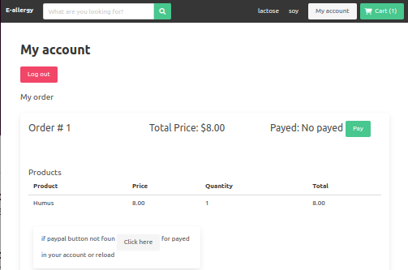
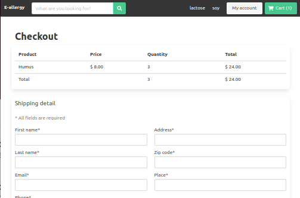
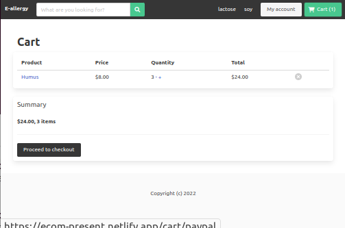

# ecom_vue
##### for look the project:
  https://ecom-present.netlify.app/


## The api of this project can be found on the github repository:
  https://github.com/Yaacov-Zerrad/e-talit

## You can also find the api online with the link:
  https://api-ecom-pre.herokuapp.com/
  
#### Here are the main addresses to add to access the different part of the API
example:
	https://api-ecom-pre.herokuapp.com/api/v1/latest-products/

  
 
#### and the rest, 
	as important especially for the login even if the one if only needs a link to redirect it where it is necessary
  
 
### sample page
     
## Project setup
```
npm install
```

### Compiles and hot-reloads for development
```
npm run serve
```

### Compiles and minifies for production
```
npm run build
```

### Customize configuration
See [Configuration Reference](https://cli.vuejs.org/config/).
